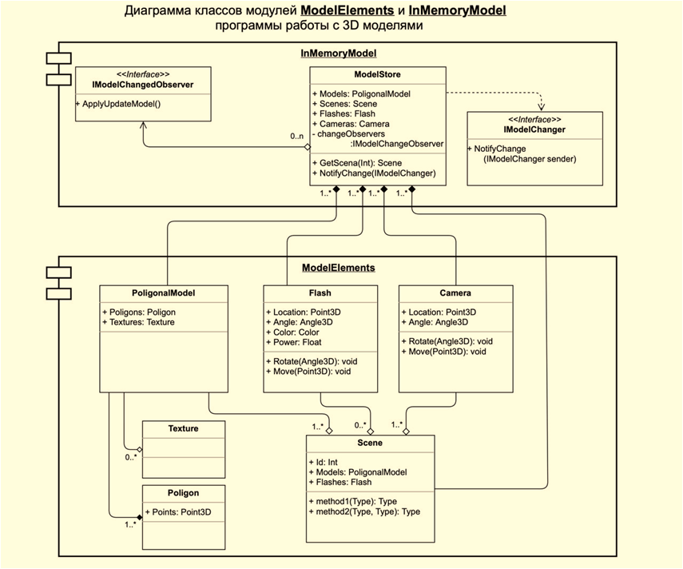

# Архитектура ПО

---

## Урок 1. Диаграммы UML

Задание:
На основе Диаграмы классов ModelElements, разработать классы:
- Model Store, PoligonalModel (Texture, Poligon), Flash, Camera, Scene

---

## Урок 2. Объектно-ориентированные паттерны

Задание 1. Паттерн Singleton

Задание 2. Паттерн Builder
